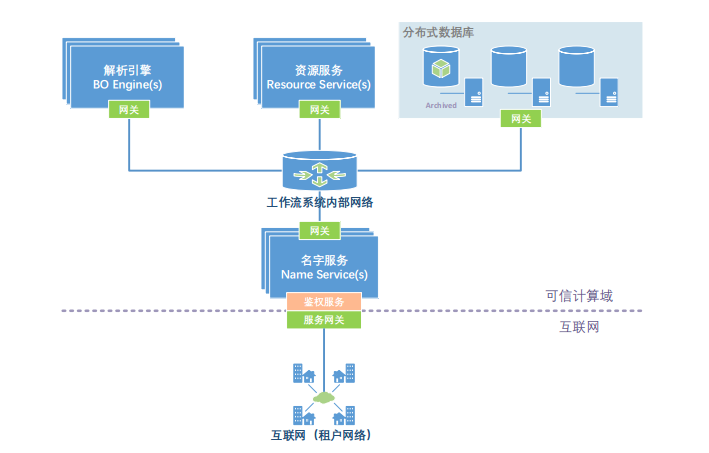
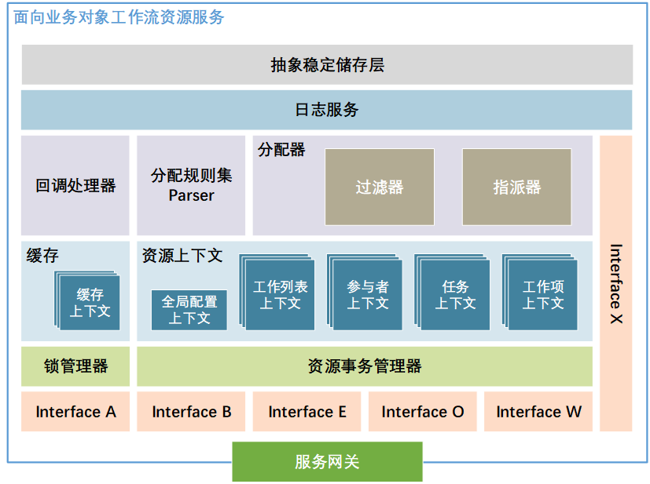
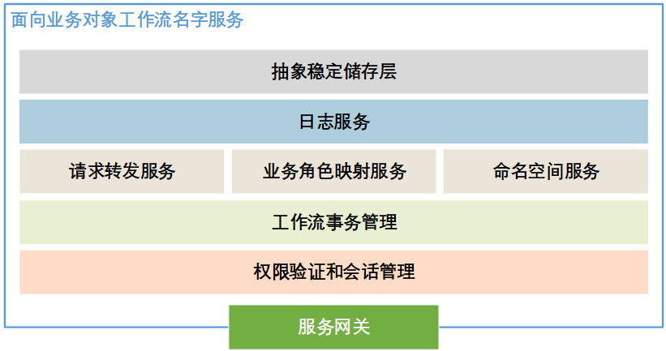
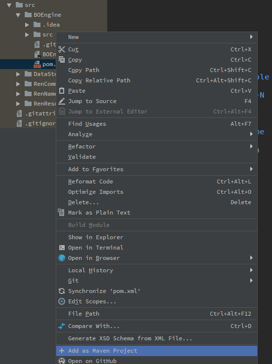
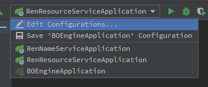
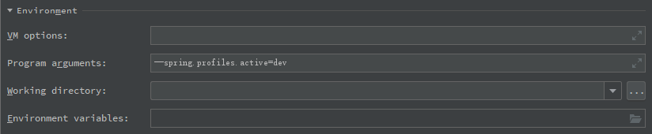
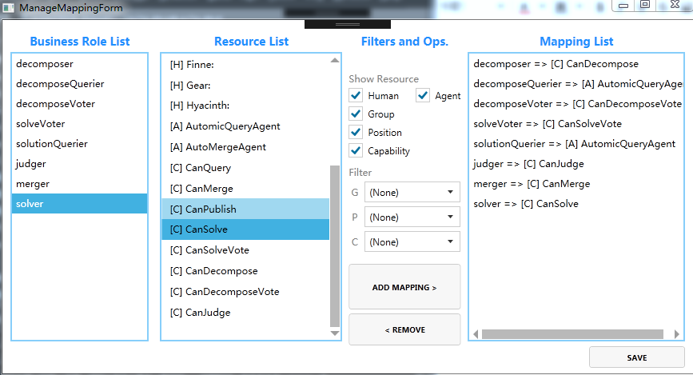

# RenWFMS

面向业务对象的工作流执行环境。


## 项目架构



架构图中的可信计算域（内网）部分共包含四个主要部分：

1. 面向业务对象工作流模型解析引擎：整个工作流执行环境的核心，负责解析用户提交的面向业务对象模型描述文件，将之实例化为业务对象。驱动工作流的进行，维护运行时信息。


2. 资源分配服务：面向业务对象工作流进行资源分配和任务调度的核心模块，对来自解析执行引擎的任务分派请求、来自流程参与者的工作项状态变更动作进行处理，管理和维护任务的工作项实例状态和所在的工作列表。



3. 名字服务：面向业务对象工作流执行环境提供流程管理、多租户支持、业务角色映射和权限验证的模块，也是直接面向用户的模块，它是执行环境的对外服务网关。



4. 分布式数据库


## 部署核心系统方案

PS：建议使用IntelliJ IDEA打开本项目

### 1. 下载源码

```git clone git@github.com:SYSU-Workflow-Lab/RenWFMS.git```

### 2. 配置项目模块

项目当前主要模块为```BOEngine```、```RenCommon```、```RenNameService```、```RenResourceService```，因此，右键这四个子项目目录内的pom.xml，选择”Add as Maven Project“，并根据提示下载相关依赖。



### 3. 写入数据库

登录MySQL客户端：```mysql -u[your username] -p[your password]```

新建数据库：```create database renboengine```

运行数据库脚本：```source \absolute path of this project\dbSchema\renboengine.sql```

### 4. 修改配置文件

以BOEngine子模块为例，本地运行时，对应开发环境下的配置文件```.\src\BOEngine\src\resources\application-dev.properties```，同理还有测试环境下的```application-test.properties```和生产环境下```application-prod.properties```两个配置文件。

### 5. 运行代码

如果要在开发环境下运行代码，需要添加运行参数。IntelliJ IDEA下编辑配置：



对每一个项目添加运行参数：



运行每个Application.java的main方法即可。


## 部署众包项目相关代码

众包（Crowdsourcing）为本项目环境下比较具有代表性的项目，用来展示面向业务对象的工作流环境的功能。

### 1. 写入数据库

与众包相关的有两个数据库，分别是```rencorgan```（sql脚本文件为```.\exampleProcess\Crowdsourcing\COranDB\rencorgan.sql```和```rencsdemo```(sql脚本文件为```.\exampleProcess\Crowdsourcing\COranDB\rencsdemo.sql```），参照上一节第三步进行写入数据库操作。

### 2. 运行COrgan

- 这是一个flask项目（项目地址为```.\externalImplSrc\COrgan```），用于组织架构系统以管理提出者和解决者资源
- 使用pip安装好依赖，注意，项目需要python2而非python3
- 运行命令为python2 COrganApp.py
- 用户名和密码均为admin

### 3. 运行RenMasterPanel

- 与Name Service交互的前端界面，用于提供流程文件，建立业务角色映射
- 使用Visual Studio打开，需要安装UWP开发功能
- 登入界面后，我们选择打开项目目录的```.\exampleProcess\Crowdsourcing\xml```目录，入口Business Object选择Request（```Request.xml```表示了众包问题的提出，而```Crowdsourcing.xml```表示了众包问题的解决过程）
- Process Name随便选择就可以了
- 进入角色映射后，点击的MANAGE MAPPINGS，添加映射，使得Mapping List如图所示



- 创建事务直接按默认就可以了
- 在回执中点击一下DEBUG START

### 4. 运行ArticleCrowdSourcingDemo

- 用于模拟整个众包的执行流程
- 使用Visual Studio打开
- 运行这个之前要做一个代码上的修改，文件在GlobalDataPackage.cs中，我们要修改PID为我们对应上传的流程文件的PID，这个可以从数据库中查看，是```renboengine```数据库中的```ren_process```表
- 同时还需要修改数据库的参数
- 修改完后，就可以运行了

### 5. 运行ArticleCrowdSourcingQueueMonitor

- 用于显示众包示例中特定执行流程实例当前的工作项（对应的角色）
- 使用Visual Studio打开
- 运行之后复制好对应的RTID就可以查看工作列表

### 6. 剩余的步骤查看视频即可

- [视频地址](http://v.youku.com/v_show/id_XMzgyMDAzNTE4NA==.html?spm=a2h3j.8428770.3416059.1)

