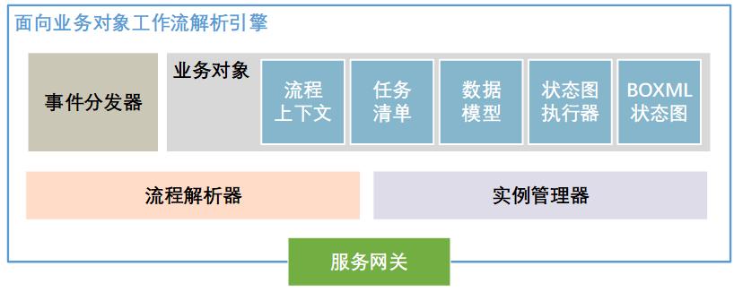

# RenWFMS

面向业务对象的工作流执行环境。


## 项目架构


<center><font size=2>图1 整体架构</font></center>

架构图中的可信计算域（内网）部分共包含四个主要部分：

1. 面向业务对象工作流模型解析引擎：整个工作流执行环境的核心，负责解析用户提交的面向业务对象模型描述文件，将之实例化为业务对象。驱动工作流的进行，维护运行时信息。



<center><font size=2>图2 解析引擎</font></center>

2. 资源分配服务：面向业务对象工作流进行资源分配和任务调度的核心模块，对来自解析执行引擎的任务分派请求、来自流程参与者的工作项状态变更动作进行处理，管理和维护任务的工作项实例状态和所在的工作列表。


<center><font size=2>图3 资源调度</font></center>

3. 名字服务：面向业务对象工作流执行环境提供流程管理、多租户支持、业务角色映射和权限验证的模块，也是直接面向用户的模块，它是执行环境的对外服务网关。


<center><font size=2>图4 名字服务</font></center>

4. 分布式数据库

## 部署核心系统方案

PS：建议使用IntelliJ IDEA打开本项目

### 1. 下载源码

```git clone git@github.com:SYSU-Workflow-Lab/RenWFMS.git```

### 2. 配置项目模块

项目当前主要模块为```BOEngine```、```RenCommon```、```RenNameService```、```RenResourceService```，因此，右键这四个子项目目录内的pom.xml，选择”Add as Maven Project“，并根据提示下载相关依赖。


### 3. 写入数据库

登录MySQL客户端：```mysql -u[your username] -p[your password]```

新建数据库：```create database renboengine```

运行数据库脚本：```source \absolute path of this project\dbSchema\renboengine.sql```

### 4. 修改配置文件

以BOEngine子模块为例，本地运行时，对应开发环境下的配置文件```.\src\BOEngine\src\resources\application-dev.properties```，同理还有测试环境下的```application-test.properties```和生产环境下```application-prod.properties```两个配置文件。

### 5. 运行代码

如果要在开发环境下运行代码，需要添加运行参数。IntelliJ IDEA下编辑配置：


对每一个项目添加运行参数：


运行每个Application.java的main方法即可。